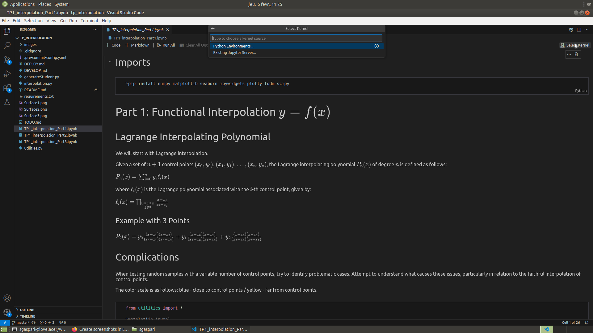
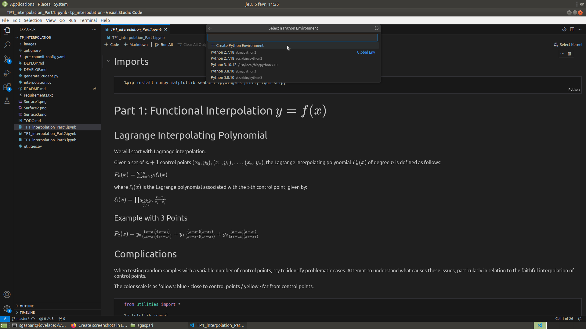
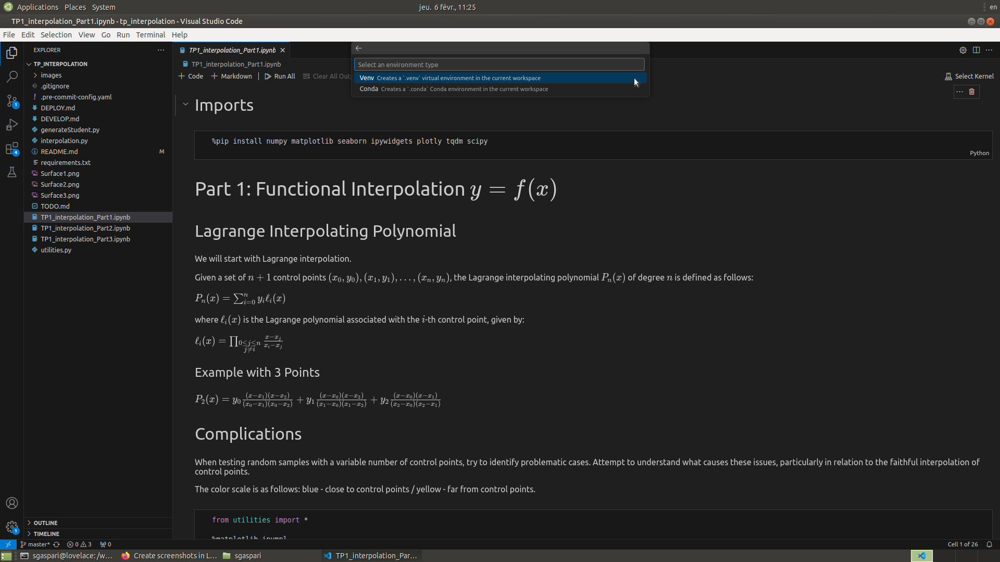
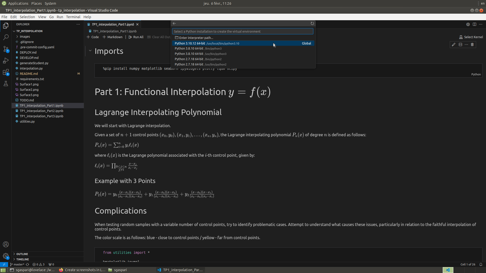
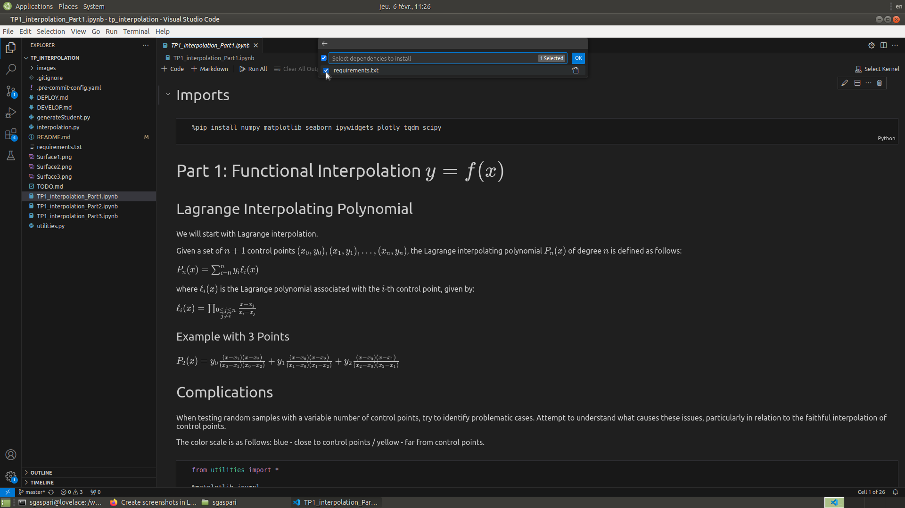

# Curve and surface Approximation

## Requirements

1. Visual Code needs some space in your home directory to install the python extension (unless you have them already installed). So you need to clean up some space in your home (say, you need at least 200MB available.)

2. The notebook requires to install a virtual environment with all the dependencies, which takes a lot of space. Place the project either in your `nosave` directory or in the `/work/` directory of the computer (remember that in this case the code will be on the local machine and you will able to get the code only from the machine).

## Setting up the environment with Visual Code

Be sure the following Visual Code extension are installed:

```bash
code --install-extension ms-python.python --install-extension ms-toolsai.jupyter
```

Then:

1. Open Visual Code at the root of the project

2. Click on the first notebook `TP_approximation.ipynb`

3. Click on `Select Kernel` on the top right of the notebook

    

    and from the dropdown menu select `Python Environments`.

4. Select `Create Python Environment`
    

5. Select `Venv` as virtual environment
    

6. As interpreter path select `Python 3.10.12 64 bit`
    

7. Check the checkbox `requirements.txt` and then click `OK`
    

    Visual Studio Code will start to install all the necessary dependencies and it will take a little while.

8. Once done you can start working on the first notebook. If the graphical interface does not work, try closing Visual Code and restart it.
